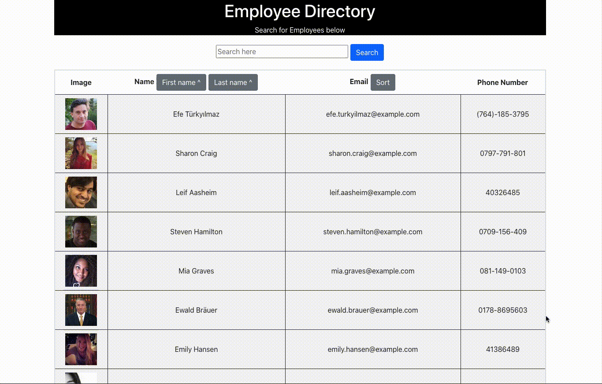

# Employee-Directory
[](https://opensource.org/licenses/MIT)

## Description
With this provided a database of employees you would bea able to easily search and sort employees



[Link to site](https://fitzpatb.github.io/Employee-Directory/);

## Table of Contents
* [Installation](#installation)
* [Usage](#usage)
* [Contribute](#contribute)
* [Questions](#questions)
## Installion
For this project be sure to run the following command in your terminal to install the necessary dependencies.
```
npm i
```

## Usage
download and install depencies thorugh a react app or visit live site
## License
MIT## Contribute
email bfitzpatrick28@gmail.com

## Questions
If you have any questions at all please reach out to [fitzpatb](https://github.com/fitzpatb/Employee-Directory) or email directly at bfitzpatrick28@gmail.com